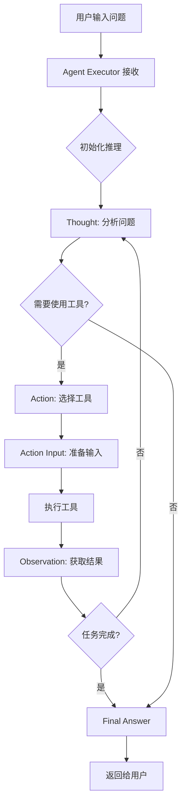

# ReAct Agent 执行流程详解

## 🎯 ReAct 模式概述

ReAct (Reasoning + Acting) 是一种让 AI 智能体能够交替进行推理和行动的模式。它模拟人类解决问题的方式：思考→行动→观察→再思考。

## 🔄 核心执行流程

### 1. 问题输入
```
用户问题: "25 * 4 + 10 等于多少？"
     ↓
```

### 2. 推理循环（Reasoning Loop）

```
┌─────────────────────────────────────┐
│         ReAct 推理循环              │
├─────────────────────────────────────┤
│                                     │
│  ┌─────────┐                       │
│  │ Thought │ ←─────────────┐       │
│  └────┬────┘               │       │
│       ↓                    │       │
│  ┌─────────┐               │       │
│  │ Action  │               │       │
│  └────┬────┘               │       │
│       ↓                    │       │
│  ┌─────────────┐           │       │
│  │ Action Input│           │       │
│  └────┬────────┘           │       │
│       ↓                    │       │
│  ┌─────────────┐           │       │
│  │ Observation │ ──────────┘       │
│  └─────────────┘                   │
│                                     │
└─────────────────────────────────────┘
```

### 3. 具体执行步骤

#### Step 1: Thought（思考）
```
LLM 思考: "我需要计算数学表达式 25 * 4 + 10。我可以使用计算器工具。"
```

#### Step 2: Action（行动决策）
```
决定使用工具: calculator
```

#### Step 3: Action Input（行动输入）
```
工具输入: "25 * 4 + 10"
```

#### Step 4: Tool Execution（工具执行）
```python
# calculator 工具实际执行
def calculate(expression: str):
    result = eval("25 * 4 + 10")  # = 110
    return f"Result: 25 * 4 + 10 = 110"
```

#### Step 5: Observation（观察结果）
```
工具返回: "Result: 25 * 4 + 10 = 110"
```

#### Step 6: Final Thought（最终思考）
```
LLM 思考: "我现在知道了最终答案。"
```

#### Step 7: Final Answer（最终答案）
```
输出: "25 * 4 + 10 等于 110。"
```

## 📊 详细流程图



## 🔧 代码实现流程

### 1. **初始化阶段**
```python
# langchain_react_agent.py
agent = LangChainReactAgent(
    llm_provider="deepseek",
    model_name="deepseek-chat",
    verbose=True
)
```

### 2. **工具注册**
```python
tools = get_basic_tools()  # 获取7个基础工具
agent.add_tools(tools)     # 注册到智能体
```

### 3. **创建 ReAct Agent**
```python
def _initialize_agent(self):
    # 创建 ReAct prompt 模板
    react_prompt = self._create_react_prompt()
    
    # 创建智能体
    self.agent = create_react_agent(
        llm=self.llm,
        tools=self.tools,
        prompt=react_prompt,
    )
    
    # 创建执行器
    self.agent_executor = AgentExecutor(
        agent=self.agent,
        tools=self.tools,
        memory=self.memory,
        verbose=self.verbose,
        max_iterations=10,  # 最多10轮推理
    )
```

### 4. **Prompt 模板结构**
```
You have access to the following tools:
- calculator: Perform mathematical calculations
- web_search: Search the web for information
...

Use the following format:
Question: the input question you must answer
Thought: you should always think about what to do
Action: the action to take, should be one of [calculator, web_search, ...]
Action Input: the input to the action
Observation: the result of the action
... (this can repeat N times)
Thought: I now know the final answer
Final Answer: the final answer to the original input question
```

### 5. **执行流程**
```python
def run(self, question: str) -> str:
    # 调用 agent_executor
    result = self.agent_executor.invoke({"input": question})
    
    # result 包含整个推理过程
    return result.get("output")  # 返回最终答案
```

## 🎭 执行示例

### 输入
```
"25 * 4 + 10 等于多少？"
```

### 内部处理
```
1. LLM 接收问题和 prompt
2. LLM 生成: "Thought: 我需要计算..."
3. LLM 生成: "Action: calculator"
4. LLM 生成: "Action Input: 25 * 4 + 10"
5. 系统执行 calculator 工具
6. 系统返回: "Result: 25 * 4 + 10 = 110"
7. LLM 看到结果
8. LLM 生成: "Final Answer: 25 * 4 + 10 等于 110。"
```

## 🔑 关键组件

### 1. **Agent（智能体）**
- 负责推理和决策
- 解析 LLM 输出
- 决定使用哪个工具

### 2. **Tools（工具）**
- 实际执行操作的函数
- 每个工具有名称、描述和执行函数
- 示例：calculator, web_search, file_system 等

### 3. **Agent Executor（执行器）**
- 协调整个流程
- 管理推理循环
- 处理错误和重试
- 限制最大迭代次数

### 4. **Memory（记忆）**
- 保存对话历史
- 提供上下文
- 支持多轮对话

### 5. **Callbacks（回调）**
- 监控执行过程
- 显示推理步骤
- 用于调试和可视化

## 🚀 优势

1. **透明性**：可以看到 AI 的推理过程
2. **可控性**：可以限制工具使用和迭代次数
3. **灵活性**：可以添加自定义工具
4. **可靠性**：错误处理和重试机制
5. **可扩展性**：易于添加新功能

## 📝 总结

ReAct Agent 的核心是一个循环：
1. **思考**问题需要什么
2. **选择**合适的工具
3. **执行**工具获取信息
4. **观察**结果
5. **继续**思考或给出答案

这种模式让 AI 能够像人类一样，通过工具和推理解决复杂问题。