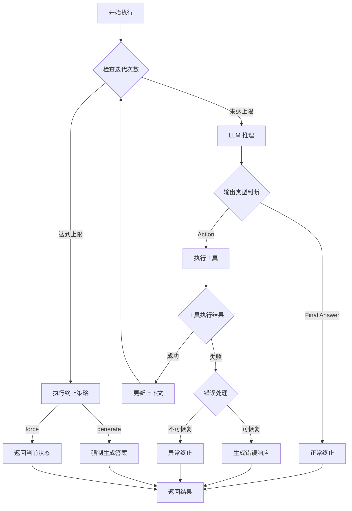

# ReAct Agent 流程终止逻辑详解

## 🛑 终止条件概述

ReAct Agent 的执行流程不会无限循环，它有多种终止条件来确保能够正常结束。

## 📋 主要终止条件

### 1. **Final Answer（最终答案）** ✅
最常见的正常终止方式。当 LLM 生成 "Final Answer:" 时，表示已经得到答案。

```
Thought: 我现在知道了答案
Final Answer: 25 * 4 + 10 等于 110。
```

### 2. **Max Iterations（最大迭代次数）** 🔄
防止无限循环的安全机制。

```python
self.agent_executor = AgentExecutor(
    agent=self.agent,
    tools=self.tools,
    max_iterations=10,  # 默认最多10轮
    early_stopping_method="generate"
)
```

### 3. **Early Stopping（提前停止）** ⏹️
有两种提前停止策略：
- `"generate"`: 达到最大迭代后，强制生成最终答案
- `"force"`: 达到最大迭代后，直接返回当前状态

### 4. **Parse Error（解析错误）** ❌
当 LLM 输出格式错误，无法解析时。

```python
handle_parsing_errors=True  # 自动处理解析错误
```

### 5. **Tool Error（工具错误）** 🔧
工具执行失败时的处理。

### 6. **Timeout（超时）** ⏱️
整体执行时间限制（可选配置）。

## 🔍 详细终止逻辑

### 1. Final Answer 检测逻辑

```python
# 在 LangChain 内部实现
def parse_output(self, text: str):
    # 检查是否包含 "Final Answer:"
    if "Final Answer:" in text:
        # 提取答案
        answer = text.split("Final Answer:")[-1].strip()
        return AgentFinish({"output": answer})
    else:
        # 继续执行
        return self.parse_action(text)
```

### 2. 迭代次数控制

```python
class AgentExecutor:
    def __call__(self, inputs):
        iterations = 0
        
        while iterations < self.max_iterations:
            # 执行一轮推理
            output = self.agent.plan(...)
            
            if isinstance(output, AgentFinish):
                # 找到最终答案，终止
                return output
            
            iterations += 1
        
        # 达到最大迭代
        return self.handle_max_iterations()
```

### 3. 错误处理终止

```python
try:
    result = tool.run(action_input)
except Exception as e:
    if self.handle_parsing_errors:
        # 尝试恢复或生成默认答案
        return self.generate_error_response(e)
    else:
        # 直接终止并抛出错误
        raise e
```

## 📊 终止流程图



## 💻 代码实现示例

### 1. 基本终止逻辑
```python
def run_agent_with_termination(self, question: str) -> str:
    """带终止逻辑的 Agent 执行"""
    
    iterations = 0
    max_iterations = 10
    
    while iterations < max_iterations:
        try:
            # 获取 LLM 输出
            output = self.llm.generate(prompt)
            
            # 检查是否为最终答案
            if "Final Answer:" in output:
                return self.extract_final_answer(output)
            
            # 解析并执行动作
            action, action_input = self.parse_action(output)
            observation = self.execute_tool(action, action_input)
            
            # 更新上下文
            self.update_context(observation)
            
        except ParseError:
            # 解析错误，尝试修复
            if self.can_recover():
                continue
            else:
                return "抱歉，我无法理解如何继续。"
        
        except ToolError as e:
            # 工具错误，生成错误信息
            return f"工具执行失败: {str(e)}"
        
        iterations += 1
    
    # 达到最大迭代
    return self.generate_timeout_response()
```

### 2. LangChain 中的配置
```python
# 创建带自定义终止逻辑的 Agent
agent_executor = AgentExecutor(
    agent=agent,
    tools=tools,
    
    # 终止相关配置
    max_iterations=10,              # 最大迭代次数
    max_execution_time=60,          # 最大执行时间（秒）
    early_stopping_method="generate", # 终止策略
    
    # 错误处理
    handle_parsing_errors=True,     # 自动处理解析错误
    
    # 回调函数
    callbacks=[
        MaxIterationsCallback(),    # 迭代次数监控
        TimeoutCallback(60),        # 超时监控
    ]
)
```

## 🎯 终止策略详解

### 1. **Generate 策略**
```python
if early_stopping_method == "generate":
    # 强制 LLM 生成一个最终答案
    force_prompt = "基于目前的信息，请给出最终答案："
    final_output = self.llm.generate(force_prompt + context)
    return final_output
```

### 2. **Force 策略**
```python
if early_stopping_method == "force":
    # 直接返回最后的观察结果
    return {
        "output": "达到最大迭代次数，返回最后的结果：" + last_observation,
        "status": "max_iterations_reached"
    }
```

## 🔧 自定义终止条件

### 1. 基于内容的终止
```python
class ContentBasedTermination:
    def should_terminate(self, output: str) -> bool:
        # 自定义终止关键词
        termination_keywords = [
            "我不知道",
            "无法回答",
            "信息不足"
        ]
        return any(keyword in output for keyword in termination_keywords)
```

### 2. 基于置信度的终止
```python
class ConfidenceBasedTermination:
    def should_terminate(self, confidence: float) -> bool:
        # 如果置信度很高，提前终止
        return confidence > 0.95
```

### 3. 基于成本的终止
```python
class CostBasedTermination:
    def __init__(self, max_cost: float):
        self.max_cost = max_cost
        self.current_cost = 0.0
    
    def should_terminate(self) -> bool:
        return self.current_cost >= self.max_cost
```

## 📈 终止状态监控

```python
class TerminationMonitor:
    def __init__(self):
        self.termination_reasons = []
    
    def log_termination(self, reason: str, details: dict):
        self.termination_reasons.append({
            "reason": reason,
            "details": details,
            "timestamp": time.time()
        })
    
    def get_termination_summary(self):
        return {
            "total_runs": len(self.termination_reasons),
            "by_reason": self.count_by_reason(),
            "average_iterations": self.avg_iterations()
        }
```

## 🎭 实际例子

### 正常终止（Final Answer）
```
Thought: 我需要计算 25 * 4 + 10
Action: calculator
Action Input: 25 * 4 + 10
Observation: Result: 110
Thought: 我现在知道了答案
Final Answer: 25 * 4 + 10 等于 110。  ← 终止点
```

### 达到最大迭代
```
Iteration 1: Thought → Action → Observation
Iteration 2: Thought → Action → Observation
...
Iteration 10: Thought → Action → Observation
[系统]: 达到最大迭代次数，生成最终答案
Final Answer: 基于当前信息...  ← 强制终止
```

### 错误终止
```
Thought: 我需要搜索信息
Action: web_search
Action Input: ...
[错误]: 网络连接失败
[系统]: 无法继续执行，返回错误信息  ← 异常终止
```

## 🔑 关键要点

1. **多层保护**：防止无限循环
2. **优雅降级**：错误时尽量给出有用信息
3. **可配置性**：可以自定义终止条件
4. **透明性**：记录终止原因
5. **鲁棒性**：处理各种异常情况

## 📝 最佳实践

1. **设置合理的最大迭代次数**（通常 5-15 次）
2. **实现错误恢复机制**
3. **记录终止原因用于分析**
4. **为不同任务类型配置不同的终止策略**
5. **监控终止模式，优化 Agent 性能**